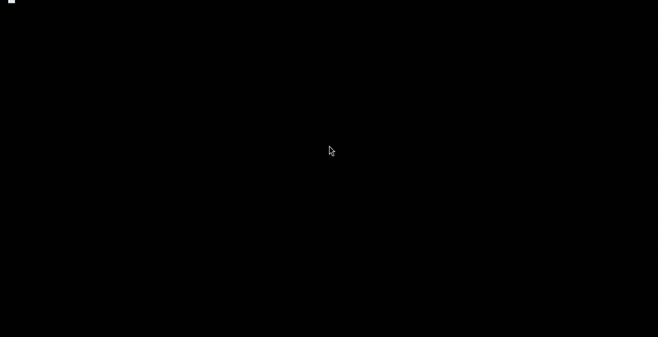
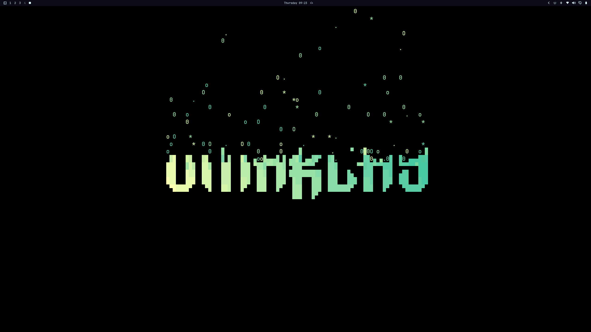
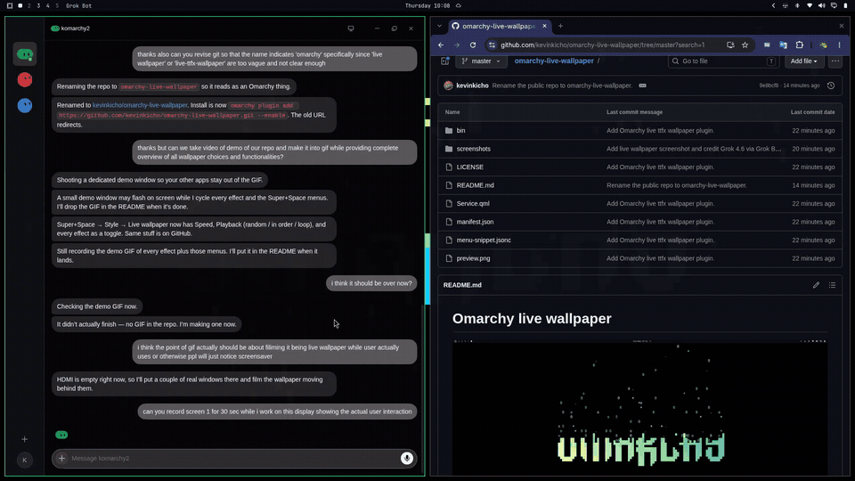
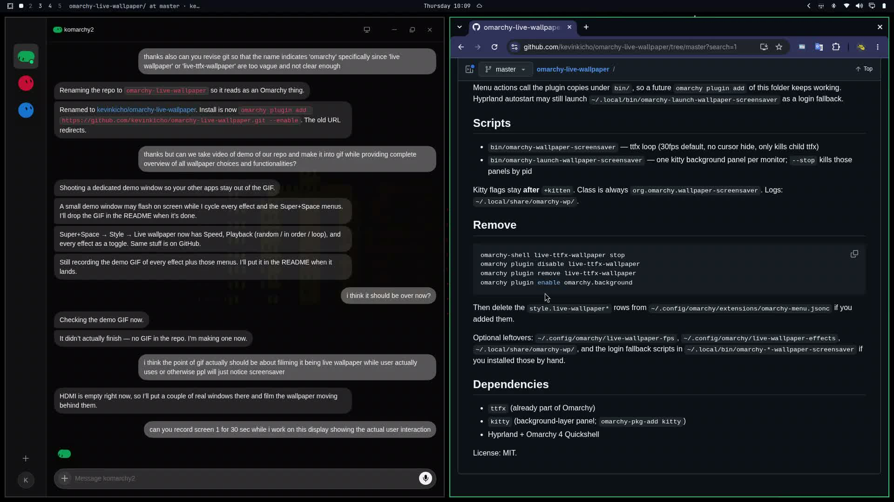

# Omarchy live wallpaper

<table>
  <tr>
    <td width="50%"></td>
    <td width="50%"></td>
  </tr>
  <tr>
    <td width="50%"></td>
    <td width="50%"></td>
  </tr>
</table>

Third-party Omarchy 4 plugin that keeps an always-on [ttfx](https://github.com/ChrisBuilds/terminaltexteffects) animation on the Hyprland background layer via `kitty +kitten panel`.

Packaged and published to GitHub by **Grok 4.6 via Grok Bot**.

This is **not** the idle screensaver. The idle screensaver uses class `org.omarchy.screensaver`. This plugin uses class `org.omarchy.wallpaper-screensaver` and never runs `pkill ttfx`.

## Super+Space settings

Open **Super+Space → Style → Live wallpaper**.

| Row | What it does |
| --- | --- |
| Enable | Disables `omarchy.background` if needed and starts the live wallpaper. Checked while the wallpaper class is running. |
| Restore static wallpaper | Stops only the live wallpaper panels, then enables `omarchy.background`. |
| Speed | `--frame-rate`: 10 / 15 / 30 / 60 / 90. Default is 30. |
| Playback → Randomize | Each cycle picks a random playlist effect (no immediate repeat when more than one). |
| Playback → In order | Walk the playlist in JSON order. |
| Playback → Loop on / Loop off | Replay forever, or play once and freeze on the last frame (`sleep infinity` keeps the kitty panel). |
| Effects → All effects | Empty playlist = every ttfx effect. |
| Effects → Edit playlist | Opens `~/.config/omarchy/live-wallpaper.json`. File order is the sequential order. |
| Effects → (each effect) | Toggle that effect. Empty playlist checks every row. |
| Only this → (each effect) | Playlist becomes just that effect, mode sequential. |
| Text → Set text | Type a word, pick a bundled FIGlet face, preview the ASCII, then write `screensaver.txt` and relaunch. |
| Text → Edit raw file | Opens `~/.config/omarchy/branding/screensaver.txt` with `omarchy-launch-editor`. |
| Text → Restore default logo | Copies `/usr/share/omarchy/logo.txt` back to `screensaver.txt` and relaunches. |

Menu rows live in the user extensions file (plugins cannot inject menu rows):

`~/.config/omarchy/extensions/omarchy-menu.jsonc`

A copy of those rows is in [`menu-snippet.jsonc`](menu-snippet.jsonc). After editing, run `omarchy menu refresh`.

Omarchy menu `provider`s (`fonts`, `apps`, `power-profiles`) are first-party-only inside `Menu.qml`, so the 36 effects are static rows rather than a custom provider.

## Set text

**Super+Space → Style → Live wallpaper → Text → Set text** opens a small gum TUI (`omarchy-launch-tui`). Type a word (placeholder `OMARCHY`), choose a face, preview the ASCII, then apply. Apply writes `~/.config/omarchy/branding/screensaver.txt` (previous file saved once as `screensaver.txt.bak`) and relaunches through `omarchy-live-wallpaper-ctl apply`.

Faces ship in `fonts/` as real `.flf` files (standard, slant, big, small, shadow, doom, banner, lean, digital, smslant, mini, bubble). No `figlet` package is required.

**Edit raw file** still opens the text in `omarchy-launch-editor`. **Restore default logo** copies `/usr/share/omarchy/logo.txt` back onto the wallpaper.

## Config

`~/.config/omarchy/live-wallpaper.json` is the source of truth. It is created on first `omarchy-live-wallpaper-ctl` use if missing:

```json
{
  "speed": 30,
  "mode": "random",
  "loop": true,
  "playlist": []
}
```

- `speed` — ttfx `--frame-rate`
- `mode` — `random` or `sequential`
- `loop` — `true` keeps cycling; `false` plays once (one random pick in random mode) then sleeps so the last frame stays
- `playlist` — effect names in order. Empty means all effects.

`bin/omarchy-live-wallpaper-ctl` writes this JSON only. Mutating commands relaunch the wallpaper.

Old flat files still work as fallbacks when the JSON is missing:

- `~/.config/omarchy/live-wallpaper-fps` — integer frame rate
- `~/.config/omarchy/live-wallpaper-effects` — `random` or a comma/space-separated include list

## Install

Needs [Omarchy](https://omarchy.org/) 4, `ttfx`, and `kitty` (only kitty can sit on the wallpaper layer).

```bash
omarchy-pkg-add kitty
omarchy plugin add https://github.com/kevinkicho/omarchy-live-wallpaper.git --enable
```

Then merge [`menu-snippet.jsonc`](menu-snippet.jsonc) into `~/.config/omarchy/extensions/omarchy-menu.jsonc` and run `omarchy menu refresh`. You should see **Style → Live wallpaper**.

```bash
omarchy plugin validate ~/.config/omarchy/plugins/live-ttfx-wallpaper
omarchy plugin enable live-ttfx-wallpaper
```

On start (plugin enabled), `Service.qml` execs the plugin launcher if the wallpaper is not already running. IPC:

```bash
omarchy-shell live-ttfx-wallpaper status
omarchy-shell live-ttfx-wallpaper restart
omarchy-shell live-ttfx-wallpaper start
omarchy-shell live-ttfx-wallpaper stop
```

Menu actions call the plugin copies under `bin/`, so a future `omarchy plugin add` of this folder keeps working. Hyprland autostart may still launch `~/.local/bin/omarchy-launch-wallpaper-screensaver` as a login fallback.

## Scripts

- `bin/omarchy-live-wallpaper-ctl` — get/set speed, mode, loop, and playlist; `apply` relaunches
- `bin/omarchy-live-wallpaper-text` — gum TUI: type text, pick a font, preview, write `screensaver.txt`, then `apply`
- `bin/omarchy-live-wallpaper-figlet` — bundled FIGlet renderer (`--font slant -- OMARCHY`); `--list` names the faces in `fonts/`
- `bin/omarchy-wallpaper-screensaver` — ttfx loop (30fps default, no cursor hide, only kills child ttfx)
- `bin/omarchy-launch-wallpaper-screensaver` — one kitty background panel per monitor; `--stop` kills those panels by pid

Effects are ttfx subcommands (`ttfx -i file --frame-rate N matrix`), not `--effect`. Kitty flags stay **after** `+kitten`. Class is always `org.omarchy.wallpaper-screensaver`. Logs: `~/.local/share/omarchy-wp/`.

## Remove

```bash
omarchy-shell live-ttfx-wallpaper stop
omarchy plugin disable live-ttfx-wallpaper
omarchy plugin remove live-ttfx-wallpaper
omarchy plugin enable omarchy.background
```

Then delete the `style.live-wallpaper*` rows from `~/.config/omarchy/extensions/omarchy-menu.jsonc` if you added them.

Optional leftovers: `~/.config/omarchy/live-wallpaper.json`, `~/.config/omarchy/live-wallpaper-fps`, `~/.config/omarchy/live-wallpaper-effects`, `~/.local/share/omarchy-wp/`, and the login fallback scripts in `~/.local/bin/omarchy-*-wallpaper-screensaver` if you installed those by hand.

## Dependencies

- `ttfx` (already part of Omarchy)
- `kitty` (background-layer panel; `omarchy-pkg-add kitty`)
- Hyprland + Omarchy 4 Quickshell

License: MIT.
